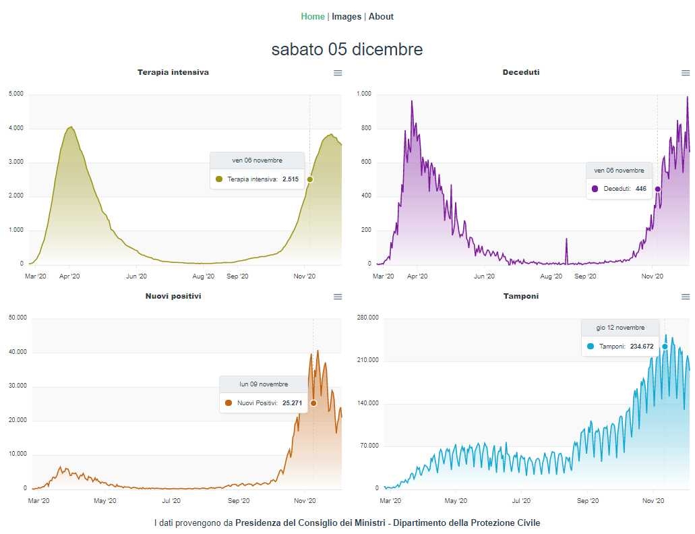
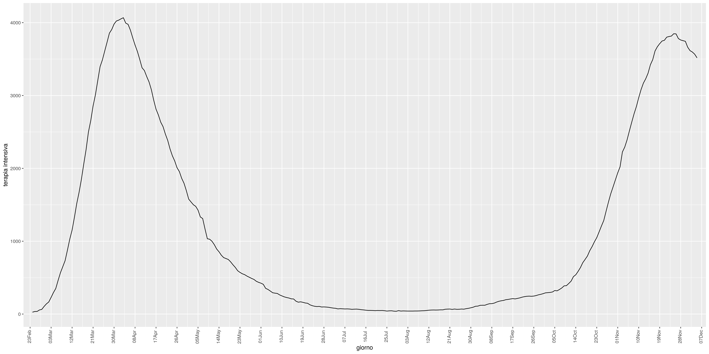
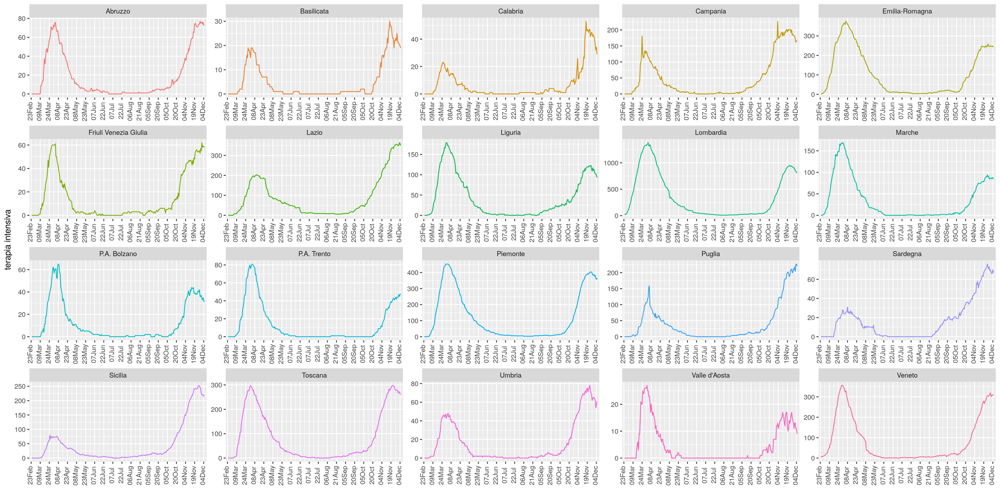

# Daily graphs on Italian Covid data

The project born as a simple standalone R script to analyze and visualize the most updated Covid related data that the Italian health ministry publish daily. In March 2020 the idea was mainly forecasting using time series analysis with HoltWinters and SARIMA, and everything was running from my PC. During November 2020 some friends asked me to provide the graphs in a better usable way. So I decided to create a cloud native application that can run in the most famous hosting platform like AWS, Azure, etc.

## Demo

The application is currently (November 2020) hosted by DigitalOcean as a Droplet, it is mainly a VPS with ssh and a great support by the platform, it includes monitoring, scaling and many complementary pluggable services. I am expecting to try other cloud providers that allow to run the app for free; it will be an interesting challenge to optimize the app till it can run on the cheapest cloud solution.

[Here](http://coviddi.ddns.net) the link to the running application. The images that follows show some samples from it.

||
|:--:| 
| *Home page of the application* |


||
|:--:| 
| *Intensive care patients in Italy, generated by R* |


||
|:--:| 
| *Intensive care patients in Italy by regions, generated by R* |

### Technologies

In origin was simply R, but it does not provide a production ready web server, so I decided to use Spring Boot as orchestrator for calling the R scripts, download the data, trigger the scheduled batches and serve the frontend. As frontend, I chose VueJs, because of the split between logic and template. Instead of javascript, I am using typescript that allows a cleaner syntax and compile time errors.

## Challenges and ToDo list

- [x] retrieve data and generate graphs with R
- [x] usa spring-boot as server and integrate Java with R
- [x] deploy the application on a remote Virtual Private Server
    - [x] run as a service
    - [x] log with syslog and log rolling
    - [x] reverse proxy with nginx
    - [x] expose in https with a verified certificate
- [x] integrate a Vue frontend with spring-boot
- [x] generate interactive graphs with a Vue using data from the underlying API
- [ ] localization
- [ ] do not rely on the underlying R, the cloud platform could not provide it anymore
- [ ] automate the deployment from github to the destination server

## Run the app

You can compile and run with the following command

```sh
mvn clean package && java -jar dist/target/*.jar
```

To generate the graphs with R you need to query the endpoint [/admin/run](http://localhost:8080/admin/run), then you can see the generated graphs at [/view-graphs](http://localhost:8080/view-graphs).

> :warning: A better gui with interactive graphs is still under development.

## Installation details

[Here](install/INSTALL.md) you can find details for the requirements if you are interested to install on your server.


## Credits

* Icons made by [Freekpik](https://www.flaticon.com/authors/freepik)
