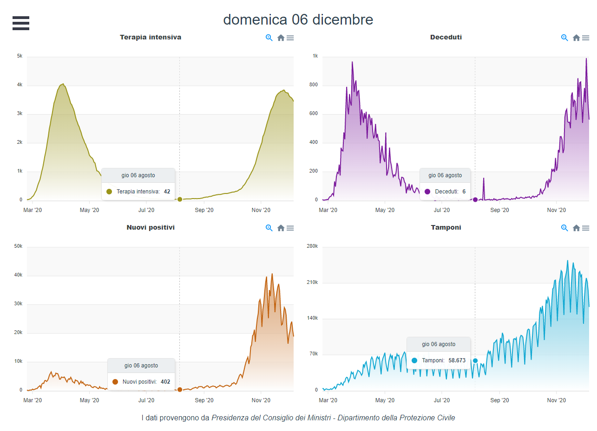
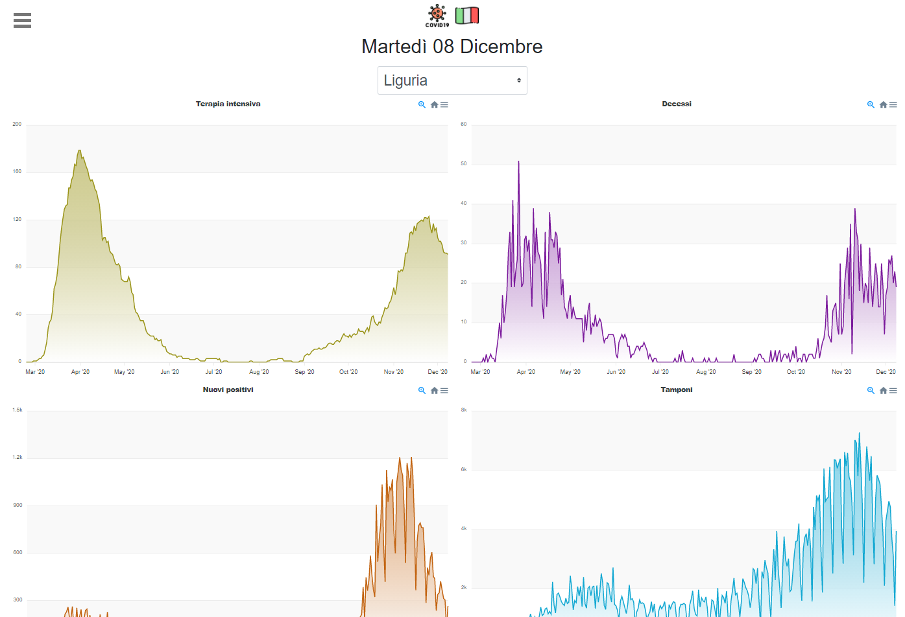

# Daily graphs on Italian Covid data

The project born as a simple standalone R script to analyze and visualize the most updated Covid related data that the Italian health ministry publish daily. In March 2020 the idea was mainly forecasting using time series analysis with HoltWinters ([link1](https://www.rdocumentation.org/packages/stats/versions/3.6.2/topics/HoltWinters), [link2](https://grisha.org/blog/2016/01/29/triple-exponential-smoothing-forecasting/)) and SARIMA ([link](https://towardsdatascience.com/understanding-sarima-955fe217bc77)), and everything was running from my PC. During November 2020 some friends asked me to provide the graphs in a better usable way. So I decided to create a cloud native application that can run in the most famous hosting platform like AWS, Azure, etc.

## Demo

The application is currently hosted [here](http://covid-sentry.ddns.net), on a cheap VPS hosting. The following images are screenshots.

||
|:--:| 
| *Homepage of the application* |

||
|:--:| 
| *Graphs by region* |


||
|:--:| 
| *Intensive care patients in Italy, generated by R* |


||
|:--:| 
| *Intensive care patients in Italy by regions, generated by R* |

### Technologies

At the beginning, the application consists of an R script running on my local PC, of course R does not provide a production ready web server. So I decided to use Spring Boot as orchestrator for calling the R scripts, download the data, trigger the scheduled batches and serve the frontend. As frontend, I chose VueJs, because of the separation of concerns between frontend logic and graphic template. Instead of javascript, I use typescript that allows a cleaner syntax and compile time warnings.

## Challenges and ToDo list

- [x] retrieve data and generate graphs with R
- [x] usa spring-boot as server and integrate Java with R
- [x] deploy the application on a remote Virtual Private Server
    - [x] run as a service
    - [x] log with syslog and log rolling
    - [x] reverse proxy with nginx
    - [x] expose in https with a verified certificate
- [x] integrate a Vue frontend with spring-boot
- [x] generate interactive graphs with a Vue using data from the underlying API
- [x] localization
- [x] if R is not available on the system, avoid the R specific features
- [ ] automate the deployment from github to the destination server

## Run the app

You can compile and run with the following command

```sh
mvn clean package && java -jar dist/target/*.jar
```

The webapp is available at [localhost:8080](http://localhost:8080).

To generate the images with R you need to query the endpoint [/admin/generate-images](http://localhost:8080/admin/generate-images).

## Installation details

[Here](install/INSTALL.md) you can find details for the requirements if you are interested to install on your server.


## Credits

* Icons made by [Freepik](https://www.flaticon.com/authors/freepik)
